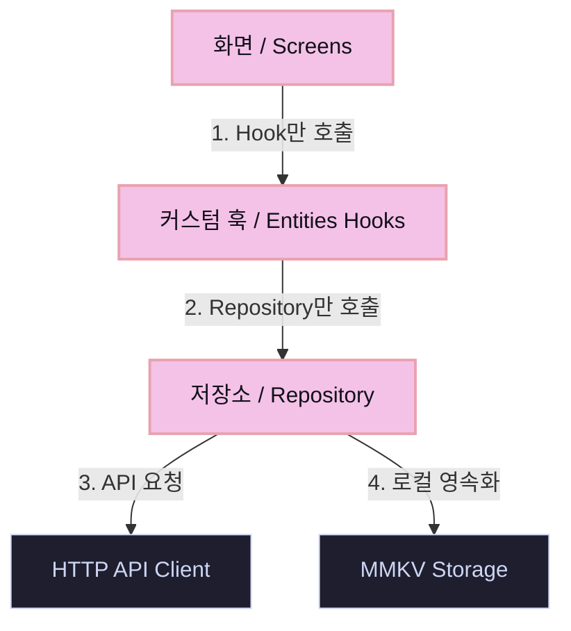

# 아키텍처 및 폴더 구조 (Architecture & Project Structure)

Studycast Frontend는 코드의 유지보수성, 확장성 및 테스트 용이성을 극대화하기 위해 **FSD (Feature-Sliced Design)** 구조와 **단방향 데이터 레이어 흐름**을 지향합니다.

---

## 1. 디렉토리 구조 및 역할

`src/` 디렉토리는 성격에 따라 다음과 같이 분할되어 각 레이어가 명확한 책임을 가집니다.

```
src/
├── app/                  # Expo Router 라우트 (File-based Routing 정의)
│   ├── (auth)/           # 인증 프로세스 관련 라우트 (signIn, signUp)
│   ├── notebook/         # 노트북 상세 화면 라우트 ([id].tsx)
│   └── _layout.tsx       # 애플리케이션 루트 레이아웃
│
├── screens/              # 실제 화면 단위 컴포넌트 (UI 렌더링)
│   ├── HomeScreen.tsx    # 메인 홈 화면
│   ├── SignInScreen.tsx  # 로그인 화면
│   └── AudioPlayerScreen.tsx # 오디오 플레이어 화면
│
├── entities/             # 도메인 모델 + 비즈니스 로직 단위 캡슐화
│   ├── auth/             # 사용자 인증 (상태, 토큰 스토어, API 훅)
│   ├── notebook/         # 학습 자료 노트북 (API, 모델, 훅)
│   ├── podcast/          # 팟캐스트 오디오 에피소드 (API, 모델, 훅)
│   ├── job/              # 오디오 생성 폴링 작업 (API, 모델, 훅)
│   ├── preferences/      # 사용자 선호도 설정 (모델, 훅)
│   └── offline/          # 오프라인 다운로드 데이터 모델
│
├── features/             # 사용자의 특정 행동/흐름 중심의 기능 슬라이스
│   └── audio/            # 전역 오디오 재생 및 제어 (Zustand 스토어, 제어 UI)
│
├── components/           # 앱 전반에서 재사용되는 일반 공통 UI 컴포넌트
│   ├── themed-text.tsx   # 다크모드 대응 텍스트
│   └── themed-view.tsx   # 다크모드 대응 뷰 컨테이너
│
├── repositories/         # 데이터 결합 및 정합성을 위한 저장소 추상화 레이어
│   └── index.ts          # 외부 결합을 최소화하는 배럴(Barrel) 파일
│
├── services/             # 인프라스트럭처 및 유틸리티 서비스
│   ├── api/              # Axios HTTP 클라이언트 설정 및 모킹 어댑터
│   └── storage/          # MMKV 래퍼 (영속화 로컬 스토리지)
│
└── shared/               # 앱 전반에 걸쳐 극도로 단순하고 재사용 가능한 공통 자원
    ├── constants/        # 테마 상수 등
    └── hooks/            # 다크모드 탐지 등 유틸리티 훅
```

---

## 2. 데이터 흐름 단방향성 원칙 (Slices Flow)

이 프로젝트는 UI 계층이 데이터 가공 및 백엔드 스펙에 의존하는 것을 방지하기 위해 엄격한 **단방향 의존성 규칙**을 적용합니다.

### 데이터 레이어 흐름도



### 아키텍처 규칙

1. **화면(Screens)은 Hook만 호출할 수 있습니다.**
   - Screens 컴포넌트는 UI 구성과 라이프사이클에만 집중하며, Repository나 Storage, API 클라이언트를 직접 호출하지 않습니다.
2. **Hook(Entities Hooks)은 Repository만 호출할 수 있습니다.**
   - React Query 훅이나 Zustand 액션 등은 Repository 인터페이스를 통해 데이터를 주고받습니다.
3. **Repository만 API와 Storage를 동시에 참조합니다.**
   - 로컬 캐싱(MMKV)과 백엔드 서버(API) 간의 정합성을 조율하며, 화면에 노출될 최종 데이터를 구성해 줍니다.
4. **결과:**
   - 백엔드의 API 설계나 로컬 저장 매체(MMKV → SQLite 등)가 바뀌더라도, **화면(Screens) 코드에는 영향을 주지 않고 Repository/API 서비스 수준에서 격리**됩니다.
